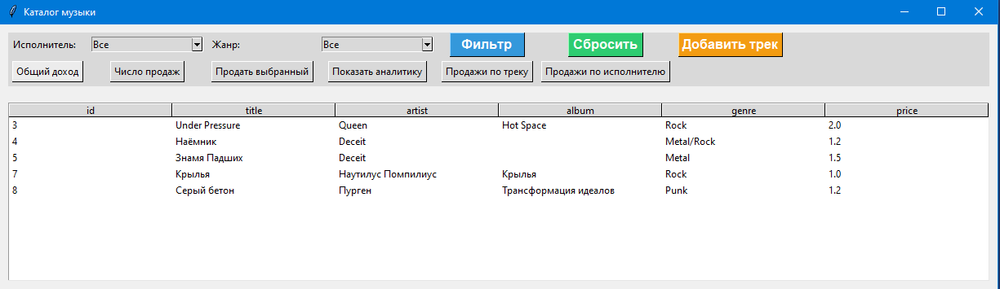

# Музыкальный каталог с продажами

## Описание
Простое приложение для работы с музыкальным каталогом и их продажами. 
Есть GUI для добавления исполнителей, треков, продаж и просмотра аналитики.

## Как запустить
1. Установите библиотеки:
pip install pandas matplotlib seaborn
2. Инициализируйте базу данных (в Python-коде или через запуск):
import storage
storage.init_db()
3. Запустите интерфейс:
python gui.py

## Структура модулей
- models.py — классы музыкальных сущностей (исполнители, треки, продажи)
- storage.py — работа с базой данных SQLite
- gui.py — графический интерфейс (Tkinter)
- analysis.py — аналитика и графики
- filter.py — фильтрация данных
- test_models.py, test_analytics.py — тесты

## Скриншоты

